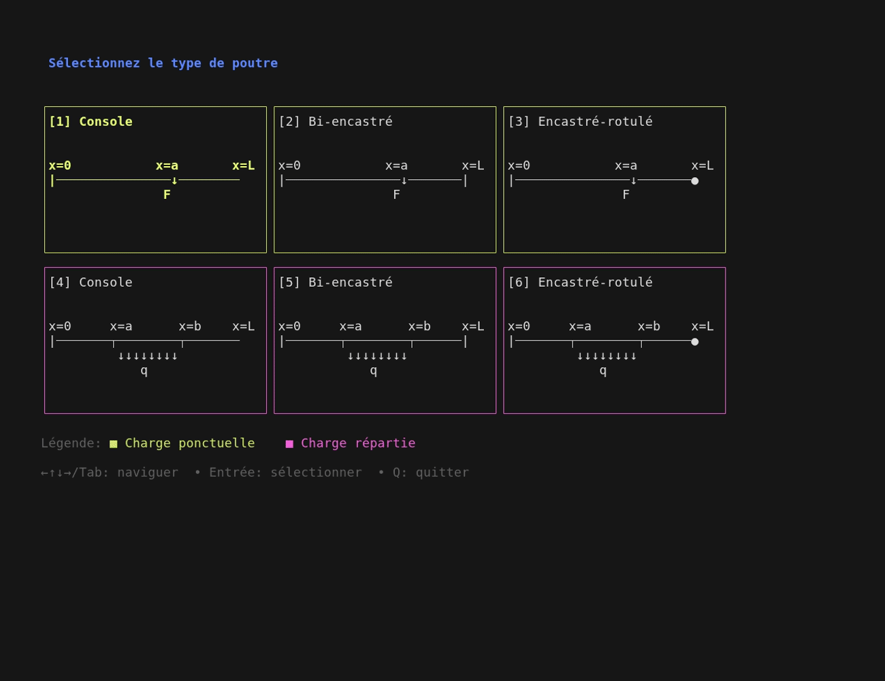

[](https://golang.org)
[](https://github.com/charmbracelet/bubbletea)
[](https://kubernetes.io)
[](https://fenicsproject.org)

# Beam Solver – TUI for Beam Analysis with FEniCS

A personal demo project for beam analysis using FEniCS, executed through a Jupyter pod on Kubernetes.



## ✨ Features

### Interactive beam selection
Choose from 6 beam types (cantilever, fixed-fixed, fixed-pinned), with point loads or distributed loads.

### Cross-section configuration
6 available types: rectangular, circular, hollow, I-beam, and U-shaped sections.

### Material properties
Input Young’s modulus (E) and Poisson’s ratio (ν).

### Load definition
Specify force position and magnitude.

### Kubernetes integration
Automatically sends `problem.json` to a Jupyter pod and executes the notebook using papermill.

### Results visualization
Displays stress, deformation, and comparison with analytical solutions.

## ⚙️ Installation

### Requirements
- Kubernetes cluster with access to a Jupyter Notebook service
- `kubectl` configured and working

### Option 1: Precompiled binary
```bash
wget https://github.com/yourusername/fenics-tui/releases/latest/download/beam_app
chmod +x beam_app
./beam_app
```

### Option 2: Build from source
```bash
git clone https://github.com/yourusername/fenics-tui.git
cd fenics-tui
go mod download
go build -o beam_app main.go
./beam_app
```

## 🚀 Usage

1. **Launch the application**:
   ```bash
   ./beam_app
   ```

2. **Navigation**:
   - Arrow keys (↑↓←→)
   - or Vim keys (h, j, k, l)
   - Press **Enter** to validate each step

3. **Enter numeric values** when prompted

4. **After validation**:
   - `problem.json` is sent to the Jupyter pod
   - FEniCS notebook is executed
   - Results are retrieved and displayed

## 🔧 Configuration

The binary/notebook is preconfigured for a specific Kubernetes environment. To adapt it, modify the source code:

- **Kubernetes namespace**: `-n namespace`
- **Jupyter pod name**: `jupyter-name`
- **Executed notebook**: `poutre.ipynb`

## 📁 Project structure

```bash
fenics-tui/
├── main.go              # Go source code
├── go.mod               # Go dependencies
├── go.sum               # Dependency checksums
├── beam_app             # Precompiled binary (optional)
├── demo.gif             # Application demo
├── demo.tape            # Terminal recording
├── notebooks/
│   └── poutre.ipynb     # FEniCS notebook
├── LICENSE              # MIT License
└── README.md            # Documentation
```

## 📜 License

MIT License – see the LICENSE file for details.

## 🙌 Credits

Built with [Bubble Tea](https://github.com/charmbracelet/bubbletea) — a powerful framework for building terminal user interfaces in Go.
